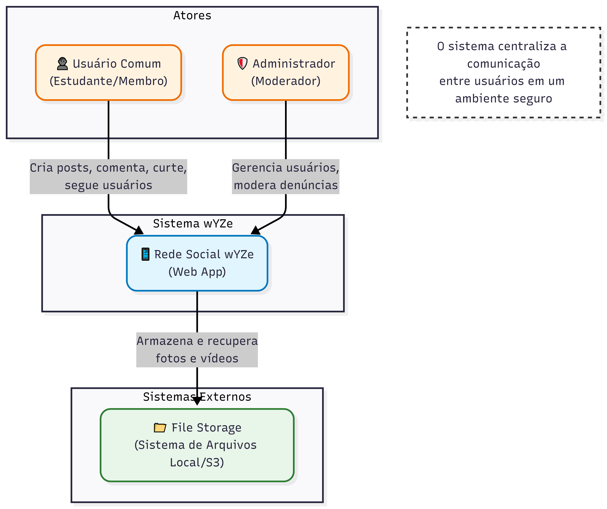
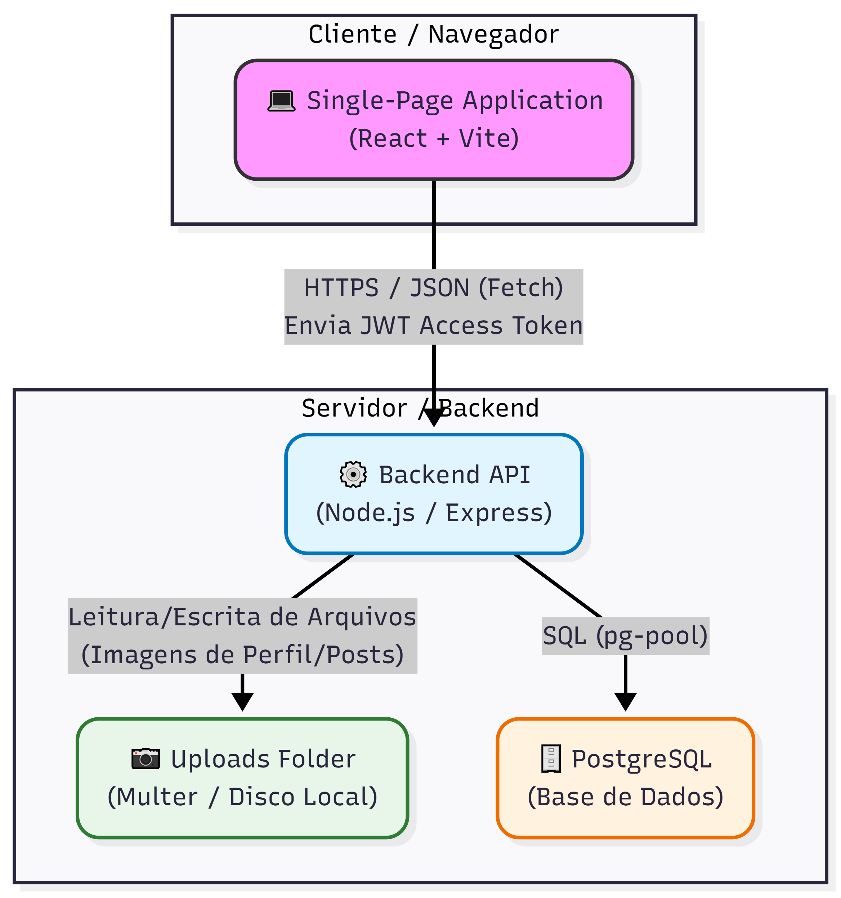
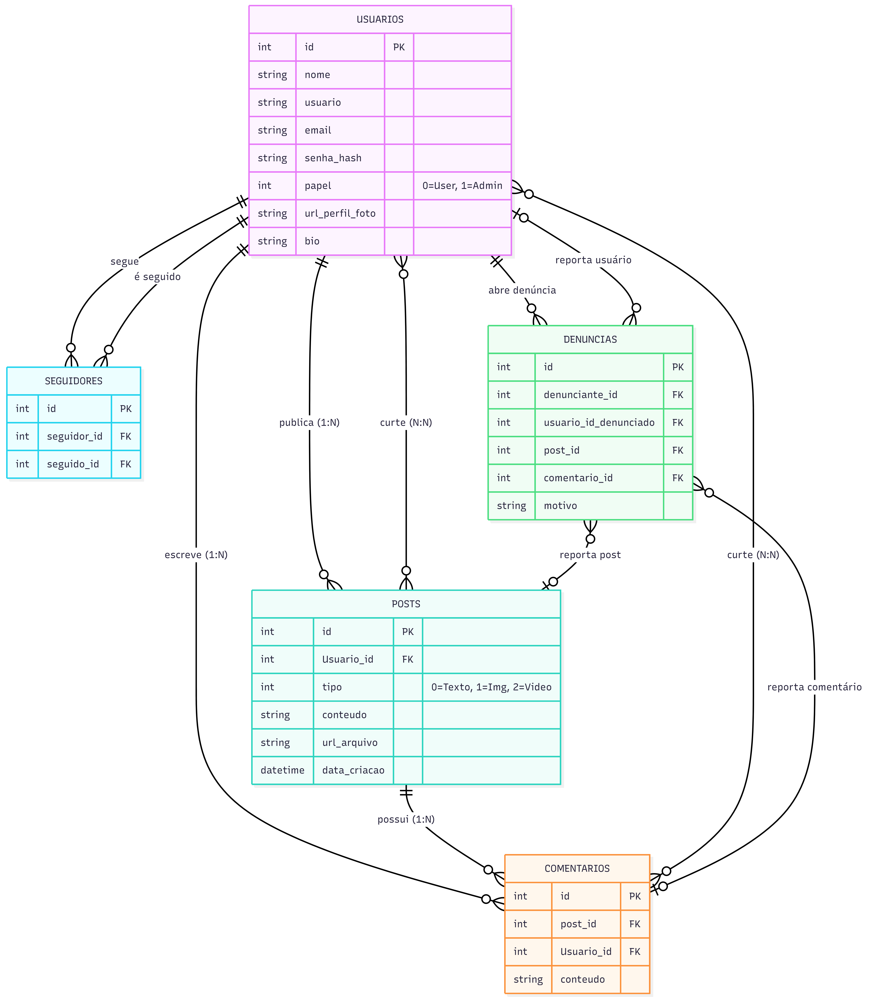
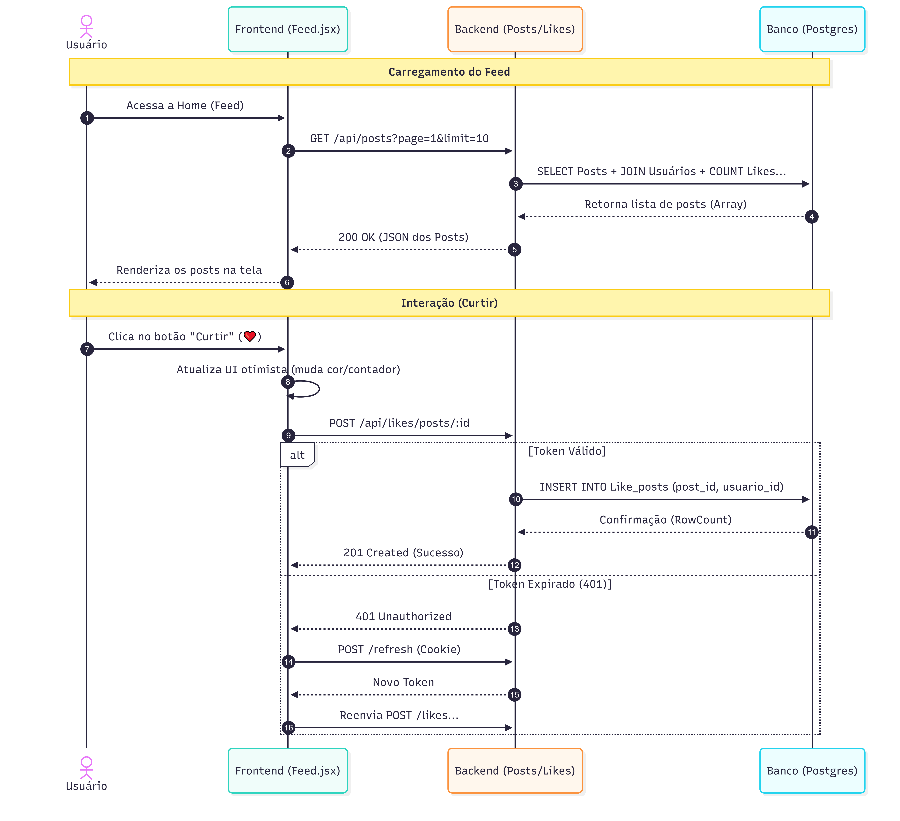

# wYZe

## 1) Problema
Muitos estudantes e pequenos grupos precisam compartilhar ideias, reflexões e discussões em um espaço simples e organizado.
Objetivo inicial: fornecer um espaço simples e seguro para escrever posts e trocar comentários, sem distrações externas.

## 2) Atores e Decisores (quem usa / quem decide)
**Usuários cadastrados:** escrevem posts, comentários, curtem e seguem outros usuários.
**Administrador:** mantém moderação dos conteúdos (pode excluir posts/comentários e banir usuários).

## 3) Casos de uso (de forma simples)
**Todos:** Registrar, logar/deslogar no sistema; Manter dados cadastrais.

**Usuário logado:**
    Manter (inserir, mostrar, editar, remover) seus próprios posts.
    Manter (inserir, mostrar, editar, remover) seus comentários.
    Interagir (curtir posts/comentários, seguir usuários).

**Administrador:**
    Manter (listar, mostrar, editar, remover) todos os posts.
    Manter (listar, mostrar, editar, remover) todos os comentários.
    Interagir (curtir posts/comentários, seguir usuários).
    Gerenciar denúncias.

## 4) Limites e suposições
**Limites:** entrega final até o fim da disciplina (ex.: 2025-11-30); rodar no navegador; não usar serviços pagos.
**Suposições:** internet disponível em laboratório; GitHub acessível; banco de dados remoto acessível; 10 min disponíveis para teste rápido.
**Plano B:** sem internet → rodar local com SQLite e salvar dados em arquivo; sem tempo do professor → testar com 3 colegas.

## 5) Hipóteses + validação
**Valor:** Se os usuários puderem criar posts e trocar comentários em um espaço dedicado, terão mais organização e clareza nas discussões do que em redes sociais.
    *Validação:* teste com 5 usuários; sucesso se ≥4 conseguirem criar post, comentar e editar sem ajuda.
**Viabilidade:** Com app web (React + Express + banco em nuvem), criar e listar posts e comentários deve responder em menos de 1 segundo em 9 de cada 10 ações.
    *Validação:* medir no protótipo com 30 ações; meta: pelo menos 27/30 em até 1s.

## 6) Fluxo principal e primeira fatia
**Fluxo principal:**
1.  Usuário cria conta e faz login.
2.  Usuário acessa página de posts.
3.  Usuário cria um post.
4.  Outros usuários curtem e comentam no post.
5.  Usuários podem seguir outros usuários.
6.  Usuário pode editar ou remover seus posts/comentários.
7.  Administrador pode moderar conteúdos.

**Primeira fatia vertical:**
Inclui: login simples, criar post, listar posts, criar comentário.
Critérios de aceite:
Post criado → aparece na lista com título, autor e data.
Comentário criado → aparece vinculado ao post.
Logout → usuário não consegue mais criar/editar posts ou comentários.

## 7) Esboços de algumas telas (wireframes)
Login/Registro

Lista de posts (título, autor, data, nº de comentários)

Detalhes do post (conteúdo + comentários listados)

Criar post (formulário simples)

Criar comentário (campo embaixo do post)

Painel do admin (listar/remover posts e comentários)


Diagrama de contexto



Diagrama de Conteiner



Diagrama de ERD



Diagrama de Sequencia Incial (login e criar post)


Diagrama de Sequencia Secundário (feed e interações)



## 8) Tecnologias

### 8.1 Navegador
**Navegador:** HTML/CSS/JS/Bootstrap  
**Armazenamento local:**   
**Hospedagem:** Github Pages

### 8.2 Front-end (servidor de aplicação, se existir)
**Front-end:** React  
**Hospedagem:** Github Pages

### 8.3 Back-end (API/servidor, se existir)
**Back-end (API):** Node.js com Express 
**Banco de dados:** Postgres
**Deploy do back-end:** Render.

## 9) Plano de Dados (Dia 0) — somente itens 1–3

### 9.1 Entidades
Usuário — pessoa que usa o sistema (autor de posts/comentários).

Post — texto criado por um usuário.

Comentário — resposta vinculada a um post.

Like - ação de curtir posts ou comentários.

Seguidores - ação de seguir outros usuários.

Denúncias - denúncia de posts, comentários ou usuários.

### 9.2 Campos por entidade

### Usuario
| Campo           | Tipo                          | Obrigatório | Exemplo            |
|-----------------|-------------------------------|-------------|--------------------|
| id              | número                        | sim         | 1                  |
| nome            | texto                         | sim         | "Ana Souza"        |
| usuario         | texto                         | sim         | "ana_souza"        |
| email           | texto                         | sim (único) | "ana@exemplo.com"  |
| bio             | texto                         | não         | "desenvolvedor fs" |
| senha_hash      | texto                         | sim         | "$2a$10$..."       |
| papel           | número (0=usuario, 1=admin)   | sim         | 0                  |
| url_perfil_foto | texto                         | nao         | "fgdsfsafag"       |
| dataCriacao     | data/hora                     | sim         | 2025-08-20 14:30   |
| dataAtualizacao | data/hora                     | sim         | 2025-08-20 15:10   |

### Post
| Campo           | Tipo               | Obrigatório | Exemplo                 |
|-----------------|--------------------|-------------|-------------------------|
| id              | número             | sim         | 2                       |
| Usuario_id      | número (fk)        | sim         | 1                       |
| tipo            | número             | sim         | "0"                     |
| conteudo        | texto              | sim         | "React é..."            |
| url_arquivo     | texto              | nao         | "fgdsfsafag"       |
| dataCriacao     | data/hora          | sim         | 2025-08-20 14:35        |
| dataAtualizacao | data/hora          | sim         | 2025-08-20 14:50        |

### Comentario
| Campo           | Tipo               | Obrigatório | Exemplo                 |
|-----------------|--------------------|-------------|-------------------------|
| id              | número             | sim         | 2                       |
| Usuario_id      | número (fk)        | sim         | 1                       |
| post_id         | numero (fk)        | sim         | 5                       |
| conteudo        | texto              | sim         | "Ótimo, obrigado!"      |
| dataCriacao     | data/hora          | sim         | 2025-08-20 14:35        |
| dataAtualizacao | data/hora          | sim         | 2025-08-20 14:50        |

### Like_posts
| Campo           | Tipo               | Obrigatório | Exemplo                 |
|-----------------|--------------------|-------------|-------------------------|
| id              | número             | sim         | 2                       |
| Usuario_id      | número (fk)        | sim         | 1                       |
| post_id         | numero (fk)        | sim         | 5                       |
| dataCriacao     | data/hora          | sim         | 2025-08-20 14:35        |

### Like_comentarios
| Campo           | Tipo               | Obrigatório | Exemplo                 |
|-----------------|--------------------|-------------|-------------------------|
| id              | número             | sim         | 2                       |
| Usuario_id      | número (fk)        | sim         | 1                       |
| comentario_id   | numero (fk)        | sim         | 5                       |
| dataCriacao     | data/hora          | sim         | 2025-08-20 14:35        |

### Seguidores
| Campo           | Tipo               | Obrigatório | Exemplo                 |
|-----------------|--------------------|-------------|-------------------------|
| id              | número             | sim         | 2                       |
| idSeguindo      | número (fk)        | sim         | 1                       |
| idSeguidor      | numero (fk)        | sim         | 5                       |
| dataCriacao     | data/hora          | sim         | 2025-08-20 14:35        |

### Denúncias
| Campo           | Tipo               | Obrigatório | Exemplo                 |
|-----------------|--------------------|-------------|-------------------------|
| id              | número             | sim         | 2                       |
| denunciante_id  | número (fk)        | sim         | 1                       |
| usuario_id_denunciado      | numero (fk)        | não         | 5                       |
| post_id         | número (fk)        | não         | 1                       |
| comentario_id   | número (fk)        | não         | 1                       |
| motivo          | texto              | sim         | "Conteúdo ofensivo"     |
| dataCriacao     | data/hora          | sim         | 2025-08-20 14:35        |


### 9.3 Relações entre entidades
- Um Usuário tem muitos Posts (1→N).

- Um Post pertence a um Usuário (N→1).

- Um Post tem muitos Comentários (1→N).

- Um Comentário pertence a um Usuário e a um Post (N→1).

- Um Post pode ter muitas Curtidas (N→1).

- Um Comentário pode ter muitas Curtidas (N→1).

- Um Usuário pode curtir vários posts e comentários (N→1).

- Um Usuário pode seguir vários Usuários.

- Um Usuário pode ser seguido por vários Usuários.

- Um Usuário pode denunciar vários posts.

- Um Uusário pode denunciar vários comentários.

- Um Usuário pode denunciar vários outros Usuários.

### 9.4 Modelagem do banco de dados no POSTGRES

```sql
CREATE TABLE IF NOT EXISTS "Usuarios" (
  id                SERIAL       PRIMARY KEY,
  nome              VARCHAR(255) NOT NULL,
  usuario           VARCHAR(255) NOT NULL UNIQUE,
  email             VARCHAR(255) NOT NULL UNIQUE,
  bio               VARCHAR(255),
  senha_hash        VARCHAR(255) NOT NULL,
  papel             SMALLINT     NOT NULL CHECK (papel IN (0,1)),
  url_perfil_foto   VARCHAR(255),
  data_criacao      TIMESTAMP    NOT NULL DEFAULT now(),
  data_atualizacao  TIMESTAMP    NOT NULL DEFAULT now()
);

CREATE TABLE IF NOT EXISTS "Posts" (
  id                SERIAL       PRIMARY KEY,
  "Usuario_id"      INTEGER      NOT NULL REFERENCES "Usuarios"(id) ON DELETE CASCADE,
  tipo              SMALLINT     NOT NULL CHECK (tipo IN (0,1,2)),
  conteudo          VARCHAR(255) NOT NULL,
  url_arquivo       VARCHAR(255),
  data_criacao      TIMESTAMP    NOT NULL DEFAULT now(),
  data_atualizacao  TIMESTAMP    NOT NULL DEFAULT now()
);

CREATE TABLE IF NOT EXISTS "Comentarios" (
  id                SERIAL       PRIMARY KEY,
  post_id           INTEGER      NOT NULL REFERENCES "Posts"(id) ON DELETE CASCADE,
  "Usuario_id"      INTEGER      NOT NULL REFERENCES "Usuarios"(id) ON DELETE SET NULL,
  conteudo          VARCHAR(255) NOT NULL,
  data_criacao      TIMESTAMP    NOT NULL DEFAULT now(),
  data_atualizacao  TIMESTAMP    NOT NULL DEFAULT now()
);

CREATE TABLE IF NOT EXISTS "Like_posts" (
  id                SERIAL       PRIMARY KEY,
  post_id           INTEGER      NOT NULL REFERENCES "Posts"(id) ON DELETE CASCADE,
  "Usuario_id"      INTEGER      NOT NULL REFERENCES "Usuarios"(id) ON DELETE CASCADE,
  data_criacao      TIMESTAMP    NOT NULL DEFAULT now(),
  UNIQUE (post_id, "Usuario_id")
);

CREATE TABLE IF NOT EXISTS "Like_comentarios" (
  id                SERIAL       PRIMARY KEY,
  comentario_id     INTEGER      NOT NULL REFERENCES "Comentarios"(id) ON DELETE CASCADE,
  "Usuario_id"      INTEGER      NOT NULL REFERENCES "Usuarios"(id) ON DELETE CASCADE,
  data_criacao      TIMESTAMP    NOT NULL DEFAULT now(),
  UNIQUE (comentario_id, "Usuario_id")
);

CREATE TABLE IF NOT EXISTS "Seguidores" (
  id                SERIAL       PRIMARY KEY,
  seguidor_id       INTEGER      NOT NULL REFERENCES "Usuarios"(id) ON DELETE CASCADE,
  seguido_id        INTEGER      NOT NULL REFERENCES "Usuarios"(id) ON DELETE CASCADE,
  data_criacao      TIMESTAMP    NOT NULL DEFAULT now(),
  UNIQUE (seguidor_id, seguido_id),
  CHECK (seguidor_id <> seguido_id)
);

CREATE TABLE IF NOT EXISTS "Denuncias" (
  id                SERIAL      PRIMARY KEY,
  denunciante_id    INTEGER     NOT NULL REFERENCES "Usuarios"(id) ON DELETE CASCADE,
  usuario_id_denunciado INTEGER REFERENCES "Usuarios"(id) ON DELETE CASCADE,
  post_id           INTEGER     REFERENCES "Posts"(id)    ON DELETE CASCADE,
  comentario_id     INTEGER     REFERENCES "Comentarios"(id) ON DELETE CASCADE,
  motivo            TEXT        NOT NULL,
  data_criacao      TIMESTAMP   NOT NULL DEFAULT now(),
  CONSTRAINT alvo_valido CHECK (
    (usuario_id_denunciado IS NOT NULL AND post_id IS NULL AND comentario_id IS NULL) OR
    (usuario_id_denunciado IS NULL AND post_id IS NOT NULL AND comentario_id IS NULL) OR
    (usuario_id_denunciado IS NULL AND post_id IS NULL AND comentario_id IS NOT NULL)
  )
);

INSERT INTO "Usuarios" (nome, usuario, email, senha_hash, papel, url_perfil_foto, bio) VALUES
('Usuário Padrão', 'user', 'user@user.com.br', '$2a$10$N9qo8uLOickgx2ZMRZoMyeIjZAgcfl7p92ldGxad68LJZdL17lhWy', 0,'https://picsum.photos/200?1', 'Apenas um usuário comum.'),
('Administrador', 'adm',   'admin@admin.com.br', '$2b$12$betIdHxSj73FmjmGGN6z.Oj9yzKXzA7/Bv/rPXjVcFyTS/c9VOXza', 1, 'https://picsum.photos/200?2', 'Gerente do sistema wYZe.'),
('Maria Silva', 'maria', 'maria@email.com', '$2a$10$N9qo8uLOickgx2ZMRZoMyeIjZAgcfl7p92ldGxad68LJZdL17lhWy', 0, 'https://picsum.photos/200?3', 'Designer e fotógrafa amadora.'),
('João Pedro', 'joao', 'joao@email.com', '$2a$10$N9qo8uLOickgx2ZMRZoMyeIjZAgcfl7p92ldGxad68LJZdL17lhWy', 0, 'https://picsum.photos/200?4', 'Desenvolvedor Fullstack.'),
('Ana Clara', 'ana', 'ana@email.com', '$2a$10$N9qo8uLOickgx2ZMRZoMyeIjZAgcfl7p92ldGxad68LJZdL17lhWy', 0, 'https://picsum.photos/200?5', 'Amante de livros e café.'),
('Carlos Souza', 'carlos', 'carlos@email.com', '$2a$10$N9qo8uLOickgx2ZMRZoMyeIjZAgcfl7p92ldGxad68LJZdL17lhWy', 0, 'https://picsum.photos/200?6', 'Viajante do mundo.'),
('Beatriz Lima', 'bia', 'bia@email.com', '$2a$10$N9qo8uLOickgx2ZMRZoMyeIjZAgcfl7p92ldGxad68LJZdL17lhWy', 0, 'https://picsum.photos/200?7', 'Estudante de arquitetura.'),
('Lucas Ferreira', 'lucasf', 'lucasf@email.com', '$2a$10$N9qo8uLOickgx2ZMRZoMyeIjZAgcfl7p92ldGxad68LJZdL17lhWy', 0, 'https://picsum.photos/200?8', 'Apaixonado por tecnologia e música.'),
('Julia Mendes', 'juliamm', 'julia@email.com', '$2a$10$N9qo8uLOickgx2ZMRZoMyeIjZAgcfl7p92ldGxad68LJZdL17lhWy', 0, 'https://picsum.photos/200?9', 'Amante de natureza e trilhas.'),
('Ricardo Alves', 'ricardo', 'ricardo@email.com', '$2a$10$N9qo8uLOickgx2ZMRZoMyeIjZAgcfl7p92ldGxad68LJZdL17lhWy', 0, 'https://picsum.photos/200?10', 'Designer UX/UI.'),
('Fernanda Rocha', 'fernanda', 'ferrocha@email.com', '$2a$10$N9qo8uLOickgx2ZMRZoMyeIjZAgcfl7p92ldGxad68LJZdL17lhWy', 0, 'https://picsum.photos/200?11', 'Nutricionista e criadora de conteúdo.'),
('Paulo Henrique', 'paulo', 'paulo@email.com', '$2a$10$N9qo8uLOickgx2ZMRZoMyeIjZAgcfl7p92ldGxad68LJZdL17lhWy', 0, 'https://picsum.photos/200?12', 'Gamedev e streamer nas horas vagas.'),
('Sara Oliveira', 'saraol', 'sara@email.com', '$2a$10$N9qo8uLOickgx2ZMRZoMyeIjZAgcfl7p92ldGxad68LJZdL17lhWy', 0, 'https://picsum.photos/200?13', 'Professora e apaixonada por livros.'),
('Thiago Ramos', 'thiramos', 'thiago@email.com', '$2a$10$N9qo8uLOickgx2ZMRZoMyeIjZAgcfl7p92ldGxad68LJZdL17lhWy', 0, 'https://picsum.photos/200?14', 'Futuro cientista de dados.');

INSERT INTO "Posts" ("Usuario_id", tipo, conteudo) VALUES
(1, 0, 'Meu primeiro post'),
(2, 1, 'Olha essa imagem'),
(3, 0, 'Primeiro dia no novo emprego!'),
(4, 1, 'Compartilhando uma foto do pôr do sol 🌅'),
(5, 2, 'Vídeo engraçado do meu cachorro 🐶'),
(1, 0, 'Hoje li um livro incrível sobre programação'),
(2, 1, 'Olha essa arte digital que acabei de fazer 🎨'),
(8, 0, 'Hoje comecei um novo projeto em Node.js!', NULL),
(9, 1, 'Foto da trilha de hoje 🌄', 'https://picsum.photos/500?1'),
(10, 0, 'Novo protótipo de UI finalizado!', NULL),
(11, 2, 'Vídeo rápido sobre alimentação saudável 🍎', 'https://videos.com/saude1'),
(12, 0, 'Zerei um jogo novo ontem! 🔥', NULL),
(13, 1, 'Minha estante de livros nova 📚', 'https://picsum.photos/500?2'),
(14, 0, 'Treinando modelos de Machine Learning hoje...', NULL),
(8, 1, 'Olhem essa paisagem incrível!', 'https://picsum.photos/500?3'),
(12, 2, 'Clipes das lives de ontem 😎', 'https://videos.com/liveclips'),
(9, 0, 'Hoje aprendi algo novo sobre fotografia!', NULL);

INSERT INTO "Comentarios" (post_id, "Usuario_id", conteudo) VALUES
(1, 2, 'Meuito legal'),
(2, 1, 'Ótimo'),
(3, 1, 'Muito fofo esse cachorro!'),
(3, 2, 'Hahaha, adorei 😂'),
(4, 3, 'Qual o nome do livro?'),
(5, 4, 'Ficou top demais, parabéns!'),
(2, 5, 'Esse pôr do sol é na praia?'),
(8, 9, 'Boa sorte no projeto!'),
(9, 8, 'Que lugar lindo!'),
(10, 11, 'Ficou muito bom!'),
(11, 13, 'Conteúdo excelente, parabéns!'),
(12, 14, 'Qual jogo?'),
(13, 10, 'Sua estante está incrível!'),
(14, 8, 'Quais modelos você está treinando?'),
(9, 12, 'Quero visitar esse lugar também!'),
(10, 14, 'Qual ferramenta usou no protótipo?'),
(11, 9, 'Vou testar essa receita!');

INSERT INTO "Like_posts" (post_id, "Usuario_id") VALUES
(1, 2), (2, 1), (3, 2), (3, 5), (4, 1), (4, 3), (5, 4), (5, 2), (8, 10), (8, 11),
(9, 12), (9, 14), (9, 8),
(10, 13), (10, 9),
(11, 8), (11, 12), (11, 14),
(12, 9),
(13, 8), (13, 12),
(14, 10), (14, 11), (14, 13);

INSERT INTO "Like_comentarios" (comentario_id, "Usuario_id") VALUES
(1, 2), (2, 1), (3, 2), (4, 5), (5, 1), (8, 12),
(9, 11),
(10, 14),
(11, 9),
(12, 10),
(13, 13),
(14, 12),
(15, 8),
(16, 14),
(17, 11);

INSERT INTO "Seguidores" (seguidor_id, seguido_id) VALUES
(1, 2), (2, 1), (3, 1), (4, 2), (5, 3), (2, 5), (8, 1), (8, 2), (8, 10),
(9, 3), (9, 8),
(10, 4), (10, 13),
(11, 5),
(12, 14), (12, 9),
(13, 8), (13, 6),
(14, 1), (14, 12), (14, 9);

INSERT INTO "Denuncias" (denunciante_id, usuario_id_denunciado, motivo) VALUES
(8, 12, 'Comportamento inadequado no chat.'),
(9, 3, 'Publicação ofensiva.'),
(10, 5, 'Spam recorrente.'),
(11, 2, 'Comentário desrespeitoso.'),
(13, 14, 'Atividade suspeita detectada.');

INSERT INTO "Denuncias" (denunciante_id, post_id, motivo) VALUES
(12, 9, 'Conteúdo enganoso.'),
(14, 10, 'Imagem imprópria.');

INSERT INTO "Denuncias" (denunciante_id, comentario_id, motivo) VALUES
(9, 14, 'Comentário tóxico.'),
(8, 16, 'Resposta agressiva.');
```
## 🔧 Como rodar localmente (passo a passo)

### 1) Pré-requisitos
- **Node.js** instalado (versão LTS recomendada sendo versão 18 ou superior)  
- **PostgreSQL** rodando localmente (versão 14 ou superior)
- **Express.js** instalado

### 2) Criar arquivo `.env` na raiz do projeto e ajustar as variáveis
```env
#PORTA DO SERVIDOR DO EXPRESS
PORT=3000

# CONFIGURAÇÃO POSTGRES
DB_HOST=localhost
DB_PORT=5432
DB_USER=postgres
DB_PASSWORD=senha
DB_DATABASE=redesocial_api_db
PG_DATABASE_ADMIN=postgres
DB_DATABASE_ADMIN_PASSWORD=senha

# CAMINHO PARA O SQL DO BANCO EM POSTGRES
DB_DATABASE_FILE_PATH=./src/database/banco.sql

# CONFIGURAÇÃO JWT
JWT_ACCESS_SECRET=meu-segredo-jwt-access
JWT_REFRESH_SECRET=meu-segredo-jwt-refresh
JWT_ACCESS_EXPIRES=15m
JWT_REFRESH_EXPIRES=7d
```

### 3) Instalar dependências 
```bash
npm install
```

### 4) Criar o banco de dados
- Ajuste o caminho para o arquivo do banco de dados no .env.  
- Ajuste usuário/senha/porta conforme o seu Postgres.
- Execute o seguinte script para criar e popular o banco de dados e depois para iniciar

```bash
npm run reset-database
npm run dev   # ou: node server.js / npm start (conforme seu package.json)
```

### 5) Porta Padrão
O servidor será executado por padrão na porta 3000. Você pode acessá-lo em http://localhost:3000.

### 6) Variáveis de Ambiente
O arquivo .env é necessário para configurar a conexão com o banco de dados e a porta do servidor.

| Variável        | Descrição          | Exemplo                 |
|-----------------|--------------------|-------------------------|
| PORT              | A porta em que o servidor Express irá rodar. | 3000 |
| DB_HOST      | O endereço do servidor do banco de dados.	 | localhost         |
| DB_PORT         | A porta do servidor do banco de dados.	 | 5432          |
| DB_USER        | O nome de usuário para conectar ao banco.	 | postgres          |
| DB_PASSWORD     | A senha para o usuário do banco de dados. (Deve ser alterada no .env)	 | senha          |
| DB_DATABASE | O nome do banco de dados da aplicação. | redesocial_api_db         |
| DB_DATABASE_ADMIN_PASSWORD | A senha do superusuário do Postgres, usada pelo script de reset. (Deve ser alterada no .env) | senha      |
| PSQL_PATH | (Opcional) Caminho completo para o executável psql.exe no Windows, caso não esteja no PATH do sistema.	 | C:\...\psql.exe     |

### 7) Endpoints da API
### 🔐 Autenticação e Usuários (`/api/usuarios`)
| Método | Rota | Descrição |
|---|---|---|
| `POST` | `/register` | Cria nova conta. Body: `{ nome, usuario, email, senha }`. |
| `POST` | `/login` | Autentica usuário. Retorna Access Token e define Cookie Refresh. |
| `POST` | `/logout` | Encerra a sessão (limpa cookies). |
| `POST` | `/refresh` | Renova o Access Token usando o cookie de Refresh Token. |
| `POST` | `/foto` | Upload/Atualização da foto de perfil (Multipart/form-data). |
| `PATCH` | `/me` | Atualiza dados do perfil (nome, bio). |
| `GET` | `/perfil/:id` | Retorna dados públicos do perfil e contadores de seguidores. |
| `GET` | `/search` | Busca usuários por nome ou username. Query: `?q=termo`. |
| `GET` | `/sugestoes` | Retorna lista de usuários sugeridos para seguir. |
| `DELETE` | `/me` | Exclui a própria conta. |
| `DELETE` | `/admin/:id` | (Admin) Bane/Exclui um usuário específico. |

### 📝 Posts (`/api/posts`)
| Método | Rota | Descrição |
|---|---|---|
| `GET` | `/` | Lista posts (Feed). Params: `page`, `limit`, `feed_type=following`, `only_media`, `liked_by`. |
| `GET` | `/:id` | Detalhes de um post específico. |
| `POST` | `/` | Cria novo post. Body: `{ conteudo, tipo }` + arquivo opcional. |
| `PATCH` | `/:id` | Atualiza conteúdo do post. |
| `DELETE` | `/:id` | Remove um post (Autor ou Admin). |

### 💬 Comentários (`/api/comentarios`)
| Método | Rota | Descrição |
|---|---|---|
| `GET` | `/posts/:id/comentarios` | Lista comentários de um post (Rota em `posts.routes`). |
| `POST` | `/` | Cria comentário. Body: `{ post_id, conteudo }`. |
| `PUT` | `/:id` | Atualiza comentário. |
| `DELETE` | `/:id` | Deleta comentário. |

### ❤️ Likes (`/api/likes`)
| Método | Rota | Descrição |
|---|---|---|
| `POST` | `/posts/:id` | Curte um post. |
| `DELETE` | `/posts/:id` | Descurte um post. |
| `POST` | `/comentarios/:id` | Curte um comentário. |
| `DELETE` | `/comentarios/:id` | Descurte um comentário. |

### 👥 Seguidores (`/api/seguidores`)
| Método | Rota | Descrição |
|---|---|---|
| `POST` | `/:id` | Segue o usuário do ID informado. |
| `DELETE` | `/:id` | Deixa de seguir o usuário. |
| `GET` | `/:id/seguindo` | Lista quem o usuário segue. |
| `GET` | `/:id/seguidores` | Lista quem segue o usuário. |

### 🚨 Denúncias (`/api/denuncias`)
| Método | Rota | Descrição |
|---|---|---|
| `POST` | `/` | Cria denúncia sobre Post, Comentário ou Usuário. |
| `GET` | `/` | (Admin) Lista todas as denúncias. |
| `DELETE` | `/:id` | (Admin) Descarta/Remove uma denúncia. |

## 8) Segurança e Estrutura
**Rate Limiting:** Implementado para prevenir abusos. Limites globais e específicos para rotas de autenticação.
**Gestão de Arquivos:** O sistema remove automaticamente do disco arquivos de mídia associados a posts ou perfis quando estes são excluídos ou atualizados.
**Middlewares:**
    `auth.js`: Validação de JWT.
    `rateLimiters.js`: Controle de tráfego.
    `multer.config.js`: Filtro de upload para imagens e vídeos.